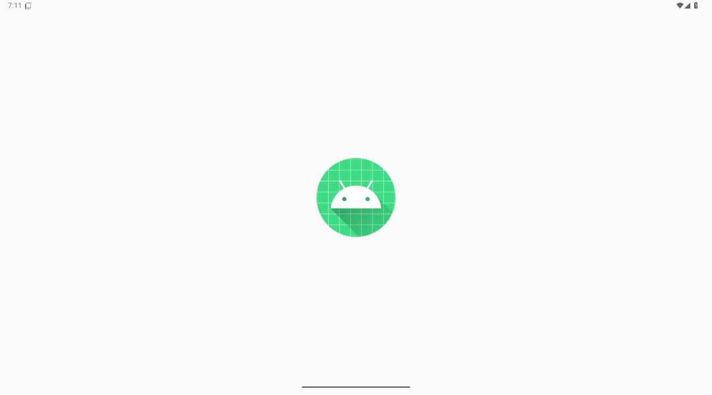
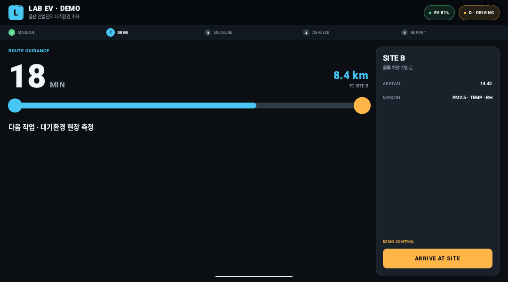
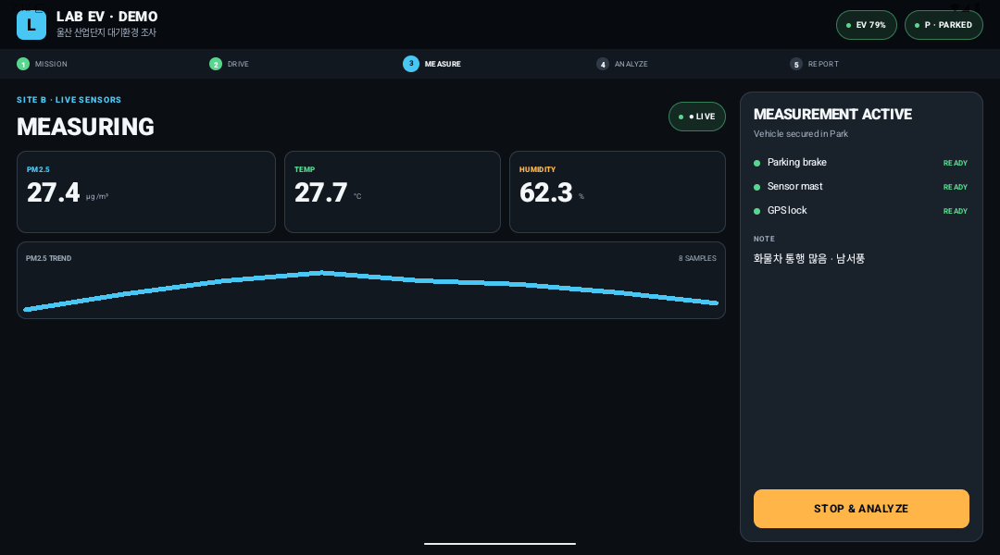
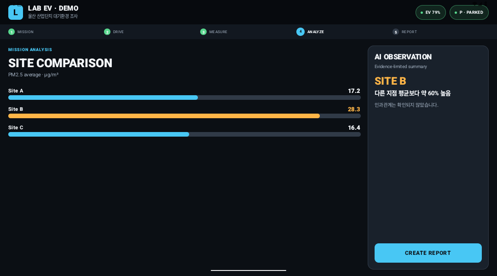
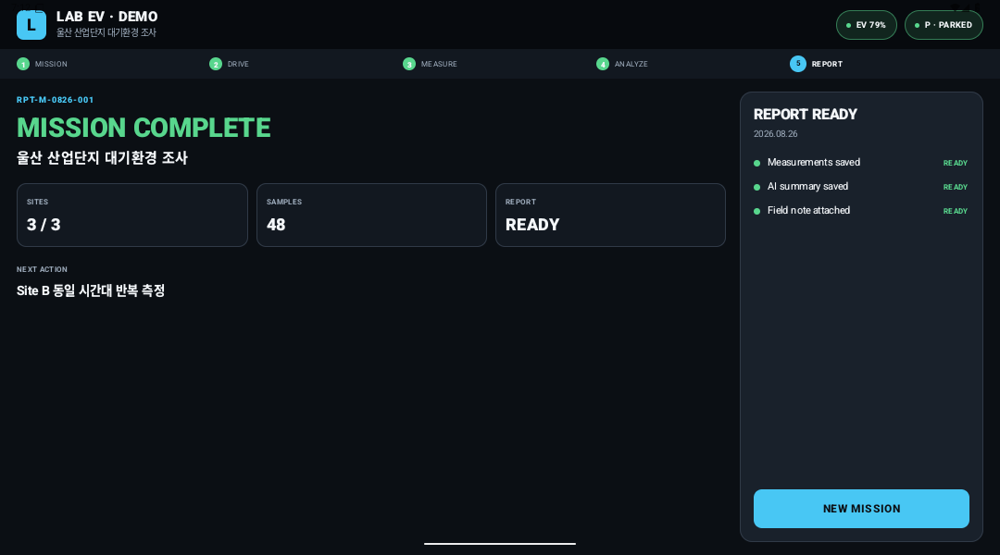

# LAB EV Mission Console

차량 안에서 현장 연구의 전 과정을 연결하는 PLEOS 기반 Android Automotive MVP입니다.

`Mission → Drive → Field Measurement → Analysis → Report`의 다섯 단계를 한 화면 체계로 구성했으며, 발표 데모에서는 울산 산업단지의 PM2.5·온도·습도 조사 시나리오를 완주할 수 있습니다.



## 핵심 경험

- **Mission** — 차량 배터리, GPS, 센서 연결 상태를 확인하고 임무 시작
- **Drive** — Site B까지 거리와 도착 예정 시간을 표시하는 주행 전용 화면
- **Field Measurement** — PM2.5·온도·습도 mock stream과 실시간 추세 그래프
- **Analysis** — 세 지점의 측정값 비교 및 근거 제한형 AI 관찰
- **Report** — 측정값, 현장 메모, 후속 권고가 포함된 보고서 초안 생성

## 화면

| Drive | Field Measurement |
|---|---|
|  |  |

| Analysis | Report |
|---|---|
|  |  |

## 차량 환경을 위한 UI 원칙

- 1080 × 600 가로형 콕핏 화면 최적화
- 어두운 배경과 고대비 상태 색상
- 주행 중 빠르게 읽을 수 있는 큰 숫자와 짧은 문장
- 주요 동작을 화면 우측 하단의 64dp 버튼에 고정
- 주행/주차 상태와 진행 단계를 항상 상단에 표시
- 주행 화면에서는 조작을 최소화하고, 측정 기능은 주차 상태에서 사용

## 기술 구성

- Kotlin
- Jetpack Compose + Material 3
- MVVM + StateFlow
- Android SDK 36 / minSdk 28
- Gradle product flavor: `demo`, `pleos`
- PLEOS Vehicle SDK 2.0.3
- PLEOS NaviHelper SDK 2.0.3
- PLEOS LLM SDK 2.1.3.2

```text
Compose UI
    ↓
MissionViewModel
    ↓
Repository interfaces
    ├─ demo  → Mock Vehicle / Navigation / Sensor / AI
    └─ pleos → Vehicle SDK / NaviHelper SDK / Mock Sensor / AI fallback
```

`MissionViewModel`은 PLEOS SDK 타입을 직접 참조하지 않습니다. SDK callback은 repository 내부에서 `StateFlow`로 변환되며 화면과 SDK의 수명주기를 분리합니다.

## 실행

Android Studio에서 프로젝트를 열고 `demoDebug` variant를 선택해 실행합니다.

Windows 터미널에서는 다음 명령으로 테스트와 APK 빌드를 실행할 수 있습니다.

```powershell
.\gradlew.bat testDemoDebugUnitTest assembleDemoDebug lintDemoDebug
```

생성 위치:

```text
app/build/outputs/apk/demo/debug/app-demo-debug.apk
```

PLEOS 전용 variant 빌드:

```powershell
.\gradlew.bat assemblePleosDebug
```

## 발표 데모 순서

1. `START MISSION`
2. Drive 화면에서 `ARRIVE AT SITE`
3. `START MEASUREMENT` 후 센서 값과 그래프 확인
4. `STOP & ANALYZE`
5. `RUN ANALYSIS`
6. `CREATE REPORT`
7. `NEW MISSION`으로 초기화

## PLEOS 연동 상태

| 영역 | v0.1 상태 |
|---|---|
| Vehicle | EV 배터리와 기어 상태를 실제 SDK callback으로 연결 |
| NaviHelper | 경로 요청, 주행 정보, 도착 callback 연결 |
| Environment Sensor | USB/BLE 장비 연결 전 mock stream 사용 |
| Gleo AI | Playground 사용 승인 전 deterministic fallback 사용 |

PLEOS Connect 전용 시스템 이미지와 앱 권한 연결이 준비되기 전에는 `demoDebug`를 사용합니다. `pleosDebug`는 빌드까지 검증됐지만 일반 Google AVD에는 PLEOS Navi Service와 VHAL이 없어 실제 SDK 동작을 검증할 수 없습니다. 인증 정보와 Playground 비밀키는 저장소에 포함하지 않습니다.

상세 내용:

- [PLEOS SDK 연동 구조](docs/PLEOS_INTEGRATION.md)
- [PLEOS Connect Emulator 설치 상태와 후속 절차](docs/PLEOS_EMULATOR_SETUP.md)

## 검증 환경

- Automotive landscape AVD: `LAB_EV_Demo`
- Android 16 / API 36 / Google APIs x86_64
- Android SDK Platform 34 설치 완료
- 화면 크기: 1080 × 600
- 다섯 화면 전환, 센서 stream, 분석, 보고서 생성, 초기화 검증
- PLEOS Connect system image는 파트너 제공 URL 수령 후 설치 예정
